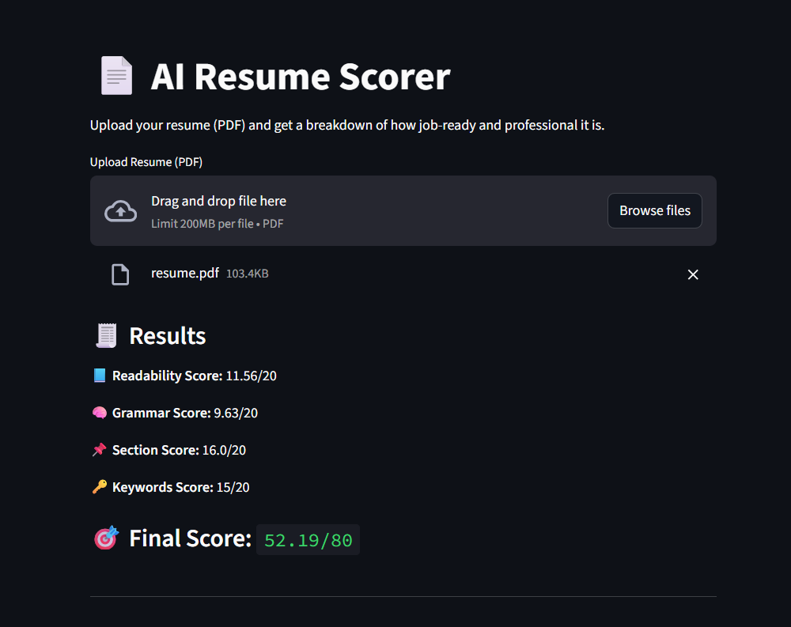

# 📄 AI Resume Scorer

A smart, AI-powered tool that analyzes your resume (PDF) and gives a professional score based on clarity, structure, grammar, and keyword relevance.

---

## 🔍 Features

- ✅ Upload and analyze any resume (PDF)
- 📊 Scores based on:
  - Readability
  - Grammar
  - Section structure
  - Keyword presence
- 💡 Smart suggestions for improvements
- ⚙️ Simple and intuitive Streamlit web interface

---

## 📁 Project Structure

```
resume_scorer/
├── app.py                # Streamlit interface
├── extract.py            # PDF text extraction
├── score.py              # Resume scoring logic
├── requirements.txt      # Python dependencies
├── README.md             # This file
```

---

## 🚀 Getting Started

### 1. Clone the repository

```bash
git clone https://github.com/ayushman-77/resume-scorer.git
cd resume_scorer
```

### 2. Create & activate virtual environment

```bash
python -m venv venv
source venv/bin/activate   # On Windows: venv\Scripts\activate
```

### 3. Install dependencies

```bash
pip install -r requirements.txt
```

### 4. Run the app

```bash
streamlit run app.py
```

---

## 🖼️ Interface Preview



---

## 🧐 How It Works

The app extracts raw text from the uploaded PDF, analyzes it using NLP libraries like:

- [`textstat`](https://pypi.org/project/textstat/) — readability scoring
- [`language-tool-python`](https://pypi.org/project/language-tool-python/) — grammar checking
- `PyMuPDF` — PDF text extraction

It scores your resume out of 80 across multiple dimensions and offers improvement suggestions.

---

## 🛠 Future Ideas

- ✅ Highlight missing sections
- ✅ Show matched keywords visually
- 🔮 Use LLMs like GPT for deeper insights
- 🌐 Deploy as a public web app
